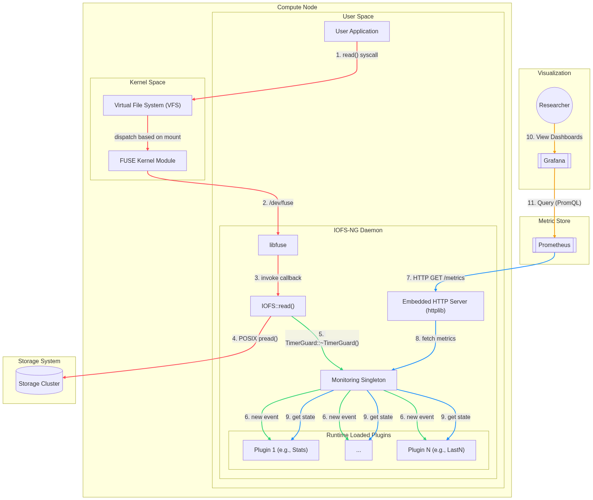

# IOFS-NG: A modular FUSE file system for I/O research and monitoring

This is a complete from scrach recode of [`gwdg/iofs`](https://github.com/gwdg/iofs) with the main purposes of **providing a pull-oriented (Prometheus-compatible) port** and **modularizing the architecture with a native-performance plugin system**.

The documentation, as well as user facing tutorials on how to write plugins, will be written soon. For now, the [technical report](./docs/report.pdf) at least provides a description of the file system design.

## Architecture

Will be filled out more soon
